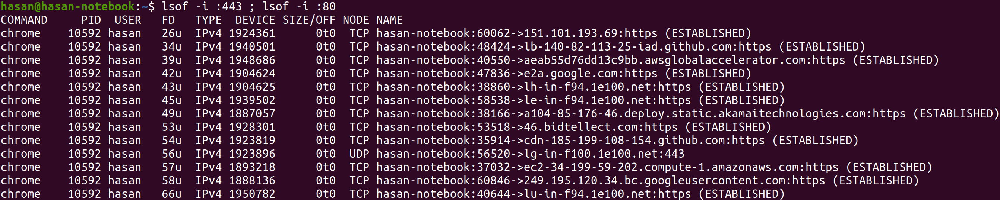
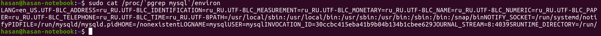

# provectus-internship-task

## Table of contents
1. [ Data Processing Task - Level 3. ](#level3)
2. [ Coding Tasks for Data Engineers. ](#codingtasks)

<a name="level3"></a>
## 1. Data Processing Task - Level 3

1. [ Prerequisites. ](#prereq)
2. [ Description. ](#desc)
3. [ Installation and Running. ](#install)
4. [ Logic. ](#logic)
5. [ Extra Notes. ](#usage)


<a name="prereq"></a>
### 1. Prerequisites
- Python 3.7 or greater
- Docker 19.03 or greater
- Git 2.28 or greater
- Postgres 13 or greater
- Docker-compose 1.26 or greater

To install `docker-compose` visit the following [link](https://docs.docker.com/compose/install/).


<a name="desc"></a>
### 2. Description
In this project we implemented a dockerized service to process users data, which is equivalent to **Level 3**. It extracts the users data `(first_name, last_name, birthts)` from `minio` and finds the image path `img_path` 
for each user (if any) and then stores the intermediate results in `minio`. Finally all processed data is then migrated to `postgres` database. The service 
periodically processes the data inside `minio/srcdata`. You can interact with the service with a `flask` server that works on two endpoints
- POST http://localhost:5000/data - Manually run data processing in `minio/src_data`
- GET http://localhost:5000/data - retrieves all records from `postgres` DB in JSON format:
```
{
  user_id1: {
      first_name: 'example_first_name',
      last_name: 'example_last_name',
      birthts: 'example_birthts',
      img_path: 'example_img_path'
  },
  user_id2: {
      ...
  },
  ...
}
```
You can apply the following filters for the retrieved data:
- `is_image_exists`=True/False
  - if True, it retrieves the records of all users that *have* an image.
  - if False, it retrieves the records of all users that * do not have* an image.
  - if it was not specified, it retrieves the records of all users in the database.
- `min_age`=MIN_AGE - if specified, it retrieves the records of all users that has a minimum age of `MIN_AGE`
- `max_age`=MAX_AGE - if specified, it retrieves the records of all users that has a maximum age of `MAX_AGE`

To apply a filter you can proved them as tags in the url, for example: [http://localhost:5000/data?min_age=35&max_age=40](http://localhost:5000/data?min_age=35&max_age=40)
returns the records of all users that age is between 35 and 40.


<a name="install"></a>
### 3. Installation and Running
Clone this repo to your local machine. `cd` to the directory of the repo `provectus-internship-task` and run:
```
sudo docker-compose up --build -d
```
Wait until you get an error `PermissionError: [Errno 13] Permission denied` from `pg_admin`.
The reason of the error is because you need to give access to minio and pgadmin directories. On the same terminal type `Ctrl+C` and then run:
```
sudo chmod 777 minio/
sudo chmod 777 pgadmin/
```
Now you need to restart the `docker-compose` containers you ran before. On the same terminal run:
```
sudo docker-compose down
sudo docker-compose up -d
```
Now the service is up and running on [http://localhost:5000/](http://localhost:5000/).


<a name="logic"></a>
### 4. Logic
When you run the command `sudo docker-compose up --build -d` the script `app.py` get excuted. First, it schedules a scheduler to keep
running the instance every 15 minutes. Then it initiates the `minioClient` and `postgres` instances and then it runs the flask app. 
Now, for each `GET` request to the server, the `app.py` calls a function from `main.py` that retrieves the data from `postgres` DB. And 
for each `POST` request, the `app.py` calls another function from `main.py` to manually process the data.

When `main.py` processes the data, it connects with the `minioClient` and `postgres` to read the files and then store the results in `output.csv`
inside `minio` and also in the `postgres` database.

<a name="usage"></a>
### 5. Extra Notes

- After you run the `docker-compose`, to manually add data to `srcdata` you need to `cd` to `provectus-internship-task/minio` and run the following command 
to give access to `srcdata` so you can paste your data there:
```
sudo chmod 777 srcdata/
```
  Now you can paste data inside the `srcdata` and test the code.


- To see the data stored in `postgres` you need to open [http://0.0.0.0:5050/browser/](http://0.0.0.0:5050/browser/) in your browser. You will be prompted to 
enter a master password. If you haven't changed it before it should be `postgres`. Then, you need to create a server. Put any name you want, but make sure 
to put the following credintials correctly:
```
Host = db
Port = 5432
Maintenance database = postgres
Username = postgres
Password = postgres
```

- In the `Dockerfile` I added the `ENV` variables for the configuration of the connections for `minio` and `postgres`. Although these 
environment variables already exist in the `docker-compose.yml` file, but they're only available during the build of the image but not after the image is built.
Now, to run the code localy, you need to remove the `web-service` from the `docker-compose.yml`. Then run the `sudo docker-compose up --build`, and then run
`python3 app.py` in the `provectus-internship-task` directory. 

I added a `.env` file to configure the connection locally. The code is set up so that, if it's not running on docker, it will
automatically use the local `.env` file for the connections.


<a name="codingtasks"></a>
## 2. Coding Tasks for Data Engineers

### SQL
1. Rewrite this SQL without subquery:
```
SELECT id
FROM users
WHERE id NOT IN (
	SELECT user_id
	FROM departments
	WHERE department_id = 1
);
```

Solution:
```
SELECT users.id as id
FROM users
LEFT JOIN departments
ON users.id = departments.user_id
WHERE departments.user_id is NULL OR departments.department_id != 1;
```

2. Write a SQL query to find all duplicate lastnames in a table named **user**
```
+----+-----------+----------+
| id | firstname | lastname |
+----+-----------+----------+
| 1  | Ivan      | Sidorov  |
| 2  | Alexandr  | Ivanov   |
| 3  | Petr      | Petrov   |
| 4  | Stepan    | Ivanov   |
+----+-----------+----------+
```

Solution:
```
SELECT last_name 
FROM user
GROUP BY last_name
HAVING COUNT(last_name) > 1;
```

3. Write a SQL query to get a username from the user table with the second highest salary from salary tables. Show the username and it's salary in the result.
```
+---------+--------+
| user_id | salary |
+---------+--------+
| 1       | 1000   |
| 2       | 1100   |
| 3       | 900    |
| 4       | 1200   |
+---------+--------+
+----+-------------+
| id | username    |
+----+-------------+
| 1  | Alex        |
| 2  | Maria       |
| 3  | Bob         |
| 4  | Sean        |
+----+-------------+
```

Solution:
```
SELECT MAX(user.username) AS username, MAX(salary.salary) AS salary
FROM user, salary
WHERE user.id = salary.user_id AND salary.salary NOT IN (
	SELECT MAX(salary)
	FROM salary
);
```
Note that we wrote `MAX(user.username)` instead of `user.username` because if the `ONLY_FULL_GROUP_BY` is disabled 
in the server configuration it will give an error. However, if the `ONLY_FULL_GROUP_BY` is enabled, then the `MAX` keyword
can be removed and the query will work just fine.

### Algorithms and Data Structures
1. Optimise execution time of this Python code snippet:
```
def count_connections(list1: list, list2: list) -> int:
  count = 0
  
  for i in list1:
    for j in list2:
      if i == j:
        count += 1
  
  return count
```
Solution:
```
def count_connections(list1: list, list2: list) -> int:
    cnt = {}

    # fill in the cnt dictionary where cnt[i] contains
    # the number of times the value i exists in list1
    for i in list1:
        if cnt.get(i) is None:
            cnt[i] = 1
        else:
            cnt[i] += 1

    count = 0

    # for each value i in list2, we sum the number of times
    # this value has occurred in list1
    for i in list2:
        count += cnt[i] if not cnt.get(i) is None else 0

    return count
```
2. Given a string `s`, find the length of the longest substring without repeating characters. Analyze your solution and please provide Space and Time complexities.

Solution:
```
# Time Complexity: O(n)
# Space Complexity: O(n)
def longest_non_repeating_substring(s: str) -> int:
    """
    :param s: the string s as described in the problem statement
    :return: the longest substring without repeating characters.
    """
    # the smallest valid start of a beginning of the substring
    start = 0
    ans = 0

    # contains the last index of each character in the string
    last_index = {}

    for i in range(len(s)):

        # if this letter is unique till index i
        if not last_index.get(s[i]) is None:
            start = max(start, last_index[s[i]] + 1)

        # update the answer
        ans = max(ans, i - start + 1)

        # update the last seen index of character s[i]
        last_index[s[i]] = i

    return ans
```
3. Given a sorted array of distinct integers and a target value, return the index if the target is found. If not, return the index where it would be if it were inserted in order.

Solution:
```
def index_of_target(nums: list, target: int):
    l, r = 0, len(nums) - 1

    # The smallest integer in nums greater or equal to target
    upper_bound = r + 1

    # use binary search to locate the index
    while l <= r:

        mid = (l + r) // 2

        if nums[mid] == target:
            return mid
        elif nums[mid] > target:
            upper_bound = mid
            r = mid - 1
        else:
            l = mid + 1

    return upper_bound
```
### Linux Shell

1. List processes listening on ports 80 and 443 - solution: `lsof -i :443 & lsof -i :80`

Note that the list of processes was very big and couldn't fit in one screen shot.
2. List process environment variables by given PID - solution: ``sudo cat /proc/`pgrep 'the process name'`/environ``

3. Launch a python program my_program.py through CLI in the background. solution: `nohup python3 my_program.py &`
The output of the script will be stored in `nohup.out` file.
	How would you close it after some period of time? solution: 
	First find the process PID using the command `ps ax | grep my_program.py`.
	Then to stop the process that is running the script, we using the command `kill 'PID of process'`

